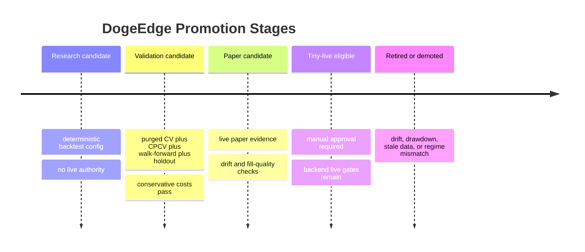

# DogeEdge Factory Final Review

## Executive Summary

Export audit verdict: usable_with_warnings. 0 schema errors and 5 schema warnings. Recomputed 5 purged folds and 10 CPCV folds from the frame sample. Reproducibility warnings: seed_not_recorded_everywhere.

## Promotion Verdict Summary

- reject: 50

## UI Compatibility

- UI-compatible fields checked: promotionVerdict, reasonCodes, robustScore, adjustedConfidence, holdoutPass, cpcvSummary.
- Split `latest.json` and `metrics.json` are accepted when split manifests are present.

## Bundle Evidence

- Rows: capped at 1000 (capped mode).
- Raw ticks: partial_sample_exported (available).
- Coverage: 3/14 target markets (21.4%); jsonl files: 3; source files: 5.
- Raw tick extraction policy: not recorded.
- Supplemental raw-tick recovery: n/a planned, n/a executed passes; n/a bytes per pass.
- Source hashes: 0 hashed, 5 skipped as large; skipped bytes: 310111532324/310111532324 (100%).
- Limitations: rows_capped, raw_market_tick_parquet_absent, raw_market_tick_jsonl_sample, raw_market_tick_target_coverage_gap, raw_market_tick_scan_budget_exhausted, raw_snapshot_hash_skipped_large_file.
- Raw tick warnings: raw_market_tick_jsonl_sample, raw_market_tick_parquet_absent, raw_market_tick_scan_budget_exhausted, raw_market_tick_target_coverage_gap, raw_snapshot_hash_skipped_large_file.
- raw_market_tick_jsonl_sample: Compact JSONL raw-tick sample files were exported for some or all requested markets.
- raw_market_tick_parquet_absent: Parquet raw-tick exports were not generated in this packet.
- raw_market_tick_scan_budget_exhausted: The scan budget was exhausted before all requested markets could be recovered.
- raw_market_tick_target_coverage_gap: One or more requested markets did not produce sample rows from available raw snapshots.
- raw_snapshot_hash_skipped_large_file: Some raw snapshot files were too large to hash under the local policy.
- schema catalog: snapshots/exported-file-schemas.json (26 files).
- Uncovered target sample: KXDOGE15M-26JUN091115-15, KXDOGE15M-26JUN091130-30, KXDOGE15M-26JUN091145-45, KXDOGE15M-26JUN091200-00, KXDOGE15M-26JUN101915-15, KXDOGE15M-26JUN101930-30, KXDOGE15M-26JUN101945-45, KXDOGE15M-26JUN102100-00, KXDOGE15M-26JUN102115-15, KXDOGE15M-26JUN102130-30 (+1 more).
- Hash-skipped source sample: raw/snapshots/2026-06-11/records.jsonl (5249982763 bytes), raw/snapshots/2026-06-10/records.jsonl (43901753519 bytes), raw/snapshots/2026-06-09/records.jsonl (67914226005 bytes), raw/snapshots/2026-06-08/records.jsonl (104823962964 bytes), raw/snapshots/2026-06-07/records.jsonl (88221607073 bytes).

## Research Gate

Gate report was not requested.

## Top Roster Reconciliation

Top roster reconciliation was not requested.

## Leakage And Alignment

Post-close detected/excluded: 496/496.
Research/live overlap: 0 IDs, 2 families; unsupported live algos: 4159.

## Promotion Timeline

